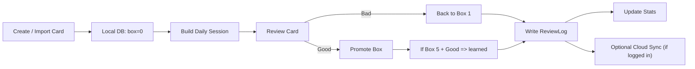

# Flashcards Leitner

Application de revision espacee (web + mobile) basee sur la methode de Leitner, avec edition Markdown/LaTeX, stockage local, synchronisation cloud optionnelle, et catalogue de packs publics via Supabase.

## Sommaire
- [Apercu](#apercu)
- [Fonctionnalites](#fonctionnalites)
- [Stack technique](#stack-technique)
- [Comment lapplication fonctionne pas a pas](#comment-lapplication-fonctionne-pas-a-pas)
- [Architecture des donnees](#architecture-des-donnees)
- [Demarrage rapide web](#demarrage-rapide-web)
- [Demarrage rapide mobile expo](#demarrage-rapide-mobile-expo)
- [Variables denvironnement](#variables-denvironnement)
- [Scripts utiles](#scripts-utiles)
- [Pipelines de contenu et geo](#pipelines-de-contenu-et-geo)
- [Tests](#tests)
- [Deploiement](#deploiement)
- [Structure du projet](#structure-du-projet)
- [Limites connues](#limites-connues)
- [Licence](#licence)

## Apercu
Le projet est organise en monorepo avec:
- une app web React/Vite (`src/`),
- une app mobile Expo (`apps/mobile/`),
- un moteur Leitner deterministe (boites 0 a 5),
- un stockage local-first (IndexedDB sur web, AsyncStorage sur mobile),
- une sync optionnelle vers Supabase apres connexion,
- des scripts de generation/import de packs publics.

## Fonctionnalites
- Sessions de revision quotidiennes avec progression Leitner.
- Support Markdown + KaTeX (formules) sur front/back.
- Tags hierarchiques (`Maths/Algebre`, `Geo/Europe/...`).
- Import/export JSON (avec media et logs).
- Bibliotheque avec filtres par tags, texte et boites.
- Packs publics Supabase importables en local (idempotent).
- Dashboard stats (volume, progression, boites, tags, taux de reussite).
- Parametres Leitner: intervalles, objectif quotidien, maintenance learned, reverse Q/A.
- Sync cloud optionnelle (auth + fusion locale/distante).

## Stack technique
- Frontend web: React 19, TypeScript, Vite, React Router.
- Mobile: React Native + Expo.
- Stockage local web: Dexie (IndexedDB).
- Stockage local mobile: AsyncStorage.
- Backend externe: Supabase (auth, tables user_*, packs publics).
- Tests: Vitest + Testing Library.

## Comment lapplication fonctionne pas a pas

### 1) Creation ou import des cartes
- Une carte creee manuellement ou importee est stockee localement.
- Un `ReviewState` est cree automatiquement avec `box=0` et `due_date=null`.
- Les packs publics importes sont marques avec `source_type='supabase_public'` pour eviter les doublons.

### 2) Construction de la session du jour
- Le moteur charge les `ReviewState` locaux.
- Il selectionne les cartes dues (`box>=1` et `due_date <= today`).
- Il ajoute aussi les cartes `learned` dues en maintenance (`learned_at + learnedReviewIntervalDays <= today`).
- Si aucune carte nest due, il prend un echantillon aleatoire de cartes `box=0` (jusqua `box1Target`) pour demarrer la session.

### 3) Deroulement dune carte en session
- La question est affichee, puis la reponse apres action utilisateur.
- Selon `reverseProbability`, front/back peuvent etre inverses aleatoirement.
- Lutilisateur repond `Good` ou `Bad`.

### 4) Mise a jour Leitner apres reponse
- `Good`: promotion de boite (jusqua 5).
- `Good` depuis la boite 5: carte marquee `learned`, sortie du flux standard.
- `Bad`: retour en boite 1.
- Chaque reponse cree un `ReviewLog`.

### 5) Stats et visualisation
- Les stats sont calculees depuis les donnees locales (cartes, review states, logs).
- Les ecrans montrent: due du jour, repartition par boites, progression 7/30 jours, perf par tags.

### 6) Synchronisation cloud optionnelle
- Si lutilisateur se connecte (Supabase Auth), la sync est activee.
- Sync initiale au login, puis toutes les 15 secondes et au focus.
- Strategie de merge: local-first defensive + upserts distants (`user_cards`, `user_progress`, `user_review_log`, `user_settings`).



## Architecture des donnees

### Web (IndexedDB / Dexie)
- `cards`: contenu des cartes + metadata source/sync.
- `reviewStates`: etat Leitner courant par carte.
- `reviewLogs`: historique des reponses.
- `media`: blobs associes aux cartes.

### Mobile (AsyncStorage)
- Snapshot structure (`cards`, `reviewStates`, `reviewLogs`, `packs`) versionne.
- Meme logique Leitner appliquee cote app mobile.

## Demarrage rapide web

### Prerequis
- Node.js 20+ recommande.
- npm.
- Un projet Supabase (URL + anon key) pour packs/auth/sync.

### Installation
```bash
npm install
```

### Configuration
Creer `/.env.local`:
```bash
VITE_SUPABASE_URL=https://<project-ref>.supabase.co
VITE_SUPABASE_ANON_KEY=<anon-key>
```

### Lancer en dev
```bash
npm run dev
```

### Verification manuelle (5 minutes)
1. Ouvrir lapp web.
2. Aller dans `Packs`, ouvrir un pack, cliquer `Import`.
3. Aller dans `Library` et verifier les cartes.
4. Lancer `Review`, repondre a quelques cartes.
5. Ouvrir `Stats` puis `Settings` pour verifier la persistance.

## Demarrage rapide mobile (Expo)

### Prerequis
- Expo Go installe sur iOS/Android.

### Lancer
```bash
npm run mobile
```

Equivalent:
```bash
cd apps/mobile
npx expo start -c
```

### Smoke check mobile
1. Ouvrir le QR code dans Expo Go.
2. `Home` puis `Play Session`.
3. `Settings` -> `Open Media Test`.
4. `Packs` -> ouvrir un pack -> `Download pack`.
5. Verifier dans `Library`.

## Variables denvironnement

### App web (`.env.local`)
- `VITE_SUPABASE_URL`
- `VITE_SUPABASE_ANON_KEY`

### App mobile (EAS secrets ou env Expo)
- `EXPO_PUBLIC_SUPABASE_URL`
- `EXPO_PUBLIC_SUPABASE_ANON_KEY`

### Pipelines Node (`.env`)
- `SUPABASE_URL`
- `SUPABASE_SERVICE_ROLE_KEY`
- `SUPABASE_DB_URL` (requis pour certaines operations SQL/seed)
- `COUNTRIES_EXCLUDE_ANTARCTICA=1` (optionnel)

### Gardes de securite (operations destructives)
- `ALLOW_DESTRUCTIVE_SUPABASE=1`
- `ALLOW_DESTRUCTIVE_COUNTRIES=1`

## Scripts utiles

### Developpement
- `npm run dev`: demarre lapp web.
- `npm run build`: build TypeScript + Vite.
- `npm run preview`: sert le build.
- `npm run lint`: lint ESLint.
- `npm run mobile`: demarre lapp mobile Expo.

### Qualite
- `npm run test`: tests unitaires.
- `npm run test:watch`: tests en watch.
- `npm run test:ui`: interface Vitest.
- `npm run check`: lint + typecheck + tests.

### Packs publics Supabase
- `npm run supabase:build`
- `npm run seed:packs`
- `npm run seed:countries-pack`
- `npm run seed:departements-pack`
- `npm run pipeline:geo-pack`

### Pipelines geographiques
- `npm run pipeline:countries`
- `npm run pipeline:departements`
- `npm run pipeline:departements-pack`

## Pipelines de contenu et geo

### Pipeline pays (SVG -> Storage -> table `countries`)
1. Generation SVG (`out/svg/{ISO2}.svg` + `out/preview.html`).
2. Upload vers bucket Supabase `country-maps`.
3. Seed/upsert SQL de `public.countries`.

Commandes:
```bash
npm run gen:country-svgs
npm run upload:country-svgs
npm run seed:countries
# ou pipeline complet
npm run pipeline:countries
```

### Pipeline departements
```bash
npm run gen:departement-svgs
npm run upload:departement-svgs
npm run seed:departements-table
npm run pipeline:departements
```

## Tests
Voir `docs/testing.md`.

Commandes principales:
```bash
npm run test
npm run check
```

Couverture actuelle:
- moteur Leitner,
- logique de sync,
- composants Markdown/media,
- smoke tests des routes principales.

## Deploiement

### Web (GitHub Pages)
- Workflow: `/.github/workflows/deploy-web.yml`
- URL: <https://v0latix.github.io/Flashcards/>
- Secrets requis: `VITE_SUPABASE_URL`, `VITE_SUPABASE_ANON_KEY`.

### Mobile (TestFlight)
Voir `docs/mobile-release.md`.

## Structure du projet
```text
.
├── src/                     # app web (routes, db, leitner, sync)
├── apps/mobile/             # app Expo
├── supabase/                # migrations / seed SQL
├── packs/                   # packs JSON locaux
├── docs/                    # specs, tests, release notes
├── src/countries-pipeline/  # generation & seed geo pays
├── src/departements-pipeline/
└── src/supabase-pipeline/   # seed packs publics
```

## Limites connues
- Pas de vraie suite E2E complete (tests majoritairement unit/smoke).
- Les appels Supabase ne sont pas executes en reseau reel pendant les tests.
- Le rendu LaTeX mobile depend dun chargement reseau (WebView + KaTeX CDN).

## Licence
MIT. Voir `LICENSE`.
