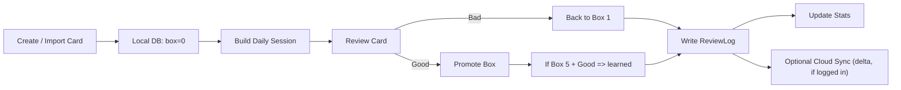

# Flashcards Leitner

Application de révision espacée (web) basée sur la méthode de Leitner, avec édition Markdown/LaTeX, stockage local-first, synchronisation cloud optionnelle (delta), partage de decks, notifications push et catalogue de packs publics via Supabase.

## Sommaire
- [Aperçu](#aperçu)
- [Fonctionnalités](#fonctionnalités)
- [Stack technique](#stack-technique)
- [Comment l'application fonctionne pas à pas](#comment-lapplication-fonctionne-pas-à-pas)
- [Architecture des données](#architecture-des-données)
- [Démarrage rapide web](#démarrage-rapide-web)
- [Variables d'environnement](#variables-denvironnement)
- [Scripts utiles](#scripts-utiles)
- [Pipelines de contenu et geo](#pipelines-de-contenu-et-geo)
- [Tests](#tests)
- [Déploiement](#déploiement)
- [Structure du projet](#structure-du-projet)
- [Limites connues](#limites-connues)
- [Licence](#licence)

## Aperçu

Application web React/Vite 100 % locale (IndexedDB), avec :
- un moteur Leitner déterministe (boîtes 0 à 5),
- une sync optionnelle vers Supabase (delta incrémental, last-write-wins),
- le partage de decks via lien public,
- des notifications Web Push quotidiennes,
- des scripts de génération/import de packs publics.

## Fonctionnalités
- Sessions de révision quotidiennes avec progression Leitner.
- **Undo** de la dernière réponse pendant une session.
- **Raccourcis clavier globaux** et **recherche globale**.
- Support Markdown + KaTeX (formules) sur front/back.
- Tags hiérarchiques (`Maths/Algèbre`, `Geo/Europe/...`).
- Import/export JSON (avec média et logs) + **import/export Anki (`.apkg`)**.
- Import CSV/TSV.
- Bibliothèque avec filtres par tags, texte et boîtes.
- **Partage de decks** — générer un lien `/share/:id`, importable par n'importe qui.
- Packs publics Supabase importables en local (idempotent).
- Dashboard stats avancé (volume, progression, boîtes, tags, streaks, taux de réussite).
- Paramètres Leitner : intervalles, objectif quotidien, maintenance learned, reverse Q/A.
- Sync cloud optionnelle : sync complète au login puis **delta incrémentale** (filtre `updated_at >= lastSync - 30s`).
- **Notifications Web Push** — rappel quotidien si des cartes sont dues (opt-in).
- **PWA** — installable, cache offline complet.
- Dark mode.
- Internationalisation français/anglais.

## Stack technique
- Frontend web : React 19, TypeScript strict, Vite, React Router 7.
- Stockage local web : Dexie (IndexedDB).
- Backend externe : Supabase (auth, tables `user_*`, `shared_decks`, packs publics).
- PWA : `vite-plugin-pwa` + Workbox.
- Tests : Vitest + React Testing Library + `fake-indexeddb`.

## Comment l'application fonctionne pas à pas

### 1) Création ou import des cartes
- Une carte créée manuellement ou importée est stockée localement.
- Un `ReviewState` est créé automatiquement avec `box=0` et `due_date=null`.
- Les packs publics importés sont marqués avec `source_type='supabase_public'` pour éviter les doublons.

### 2) Construction de la session du jour
- Le moteur charge les `ReviewState` locaux.
- Il complète la Boîte 1 chaque jour jusqu'à `box1Target` en promouvant des cartes `box=0` (si disponibles), avec `due_date=today`.
- Il sélectionne les cartes dues (`box>=1` et `due_date <= today`).
- Il ajoute aussi les cartes `learned` dues en maintenance (`learned_at + learnedReviewIntervalDays <= today`).

### 3) Déroulement d'une carte en session
- La question est affichée, puis la réponse après action utilisateur.
- Selon `reverseProbability`, front/back peuvent être inversés aléatoirement.
- L'utilisateur répond `Good` ou `Bad`. Il peut **annuler** la dernière réponse.

### 4) Mise à jour Leitner après réponse
- `Good` : promotion de boîte (jusqu'à 5).
- `Good` depuis la boîte 5 : carte marquée `learned`, sortie du flux standard.
- `Bad` : retour en boîte 1.
- Chaque réponse crée un `ReviewLog`.

### 5) Stats et visualisation
- Les stats sont calculées depuis les données locales (cartes, review states, logs).
- Les écrans montrent : due du jour, répartition par boîtes, progression 7/30 jours, perf par tags, streaks.

### 6) Synchronisation cloud optionnelle
- Si l'utilisateur se connecte (Supabase Auth), la sync est activée.
- **Sync complète** au premier login (snapshot total).
- **Sync delta** ensuite : seules les lignes modifiées depuis `lastSyncAt - 30s` sont récupérées côté remote, et seules les cartes nouvelles (sans `cloud_id`) sont poussées — les cartes déjà synchronisées absentes du snapshot delta sont ignorées (pas de résurrection).
- Sync toutes les 15 secondes (debounce) + au focus fenêtre.


```mermaid
flowchart LR
  A["Create / Import Card"] --> B["Local DB: box=0"]
  B --> C["Build Daily Session"]
  C --> D["Review Card"]
  D -->|Good| E["Promote Box"]
  D -->|Bad| F["Back to Box 1"]
  E --> G["If Box 5 + Good => learned"]
  F --> H["Write ReviewLog"]
  G --> H["Write ReviewLog"]
  H --> I["Update Stats"]
  H --> J["Optional Cloud Sync (delta, if logged in)"]
```

## Architecture des données

### Web (IndexedDB / Dexie)
- `cards` : contenu des cartes + metadata source/sync.
- `reviewStates` : état Leitner courant par carte.
- `reviewLogs` : historique des réponses.
- `media` : blobs associés aux cartes.

### Supabase (cloud, optionnel)
- `user_cards`, `user_progress`, `user_review_log`, `user_settings` : sync utilisateur.
- `shared_decks` : decks partagés publiquement (lecture publique, écriture propriétaire).
- `packs`, `public_cards` : packs publics.

## Démarrage rapide web

### Prérequis
- Node.js 20+ recommandé.
- npm.
- Un projet Supabase (URL + anon key) pour packs/auth/sync.

### Installation
```bash
npm install
```

### Configuration
Créer `/.env.local` :
```bash
VITE_SUPABASE_URL=https://<project-ref>.supabase.co
VITE_SUPABASE_ANON_KEY=<anon-key>
```

### Lancer en dev
```bash
npm run dev
```

### Vérification manuelle (5 minutes)
1. Ouvrir l'app web.
2. Aller dans `Packs`, ouvrir un pack, cliquer `Import`.
3. Aller dans `Library` et vérifier les cartes.
4. Lancer `Review`, répondre à quelques cartes.
5. Ouvrir `Stats` puis `Settings` pour vérifier la persistance.

## Variables d'environnement

### App web (`.env.local`)
- `VITE_SUPABASE_URL`
- `VITE_SUPABASE_ANON_KEY`

### Pipelines Node (`.env`)
- `SUPABASE_URL`
- `SUPABASE_SERVICE_ROLE_KEY`
- `SUPABASE_DB_URL` (requis pour certaines opérations SQL/seed)
- `COUNTRIES_EXCLUDE_ANTARCTICA=1` (optionnel)

### Gardes de sécurité (opérations destructives)
- `ALLOW_DESTRUCTIVE_SUPABASE=1`
- `ALLOW_DESTRUCTIVE_COUNTRIES=1`

## Scripts utiles

### Développement
- `npm run dev` : démarre l'app web.
- `npm run build` : build TypeScript + Vite.
- `npm run preview` : sert le build.
- `npm run lint` : lint ESLint.

### Qualité
- `npm run test` : tests unitaires.
- `npm run test:watch` : tests en watch.
- `npm run check` : lint + typecheck + tests.

### Packs publics Supabase
- `npm run supabase:build`
- `npm run seed:packs`
- `npm run seed:countries-pack`
- `npm run seed:departements-pack`
- `npm run pipeline:geo-pack`

### Pipelines géographiques
- `npm run pipeline:countries`
- `npm run pipeline:departements`
- `npm run pipeline:departements-pack`

## Pipelines de contenu et geo

### Pipeline pays (SVG → Storage → table `countries`)
1. Génération SVG (`out/svg/{ISO2}.svg` + `out/preview.html`).
2. Upload vers bucket Supabase `country-maps`.
3. Seed/upsert SQL de `public.countries`.

```bash
npm run gen:country-svgs
npm run upload:country-svgs
npm run seed:countries
# ou pipeline complet
npm run pipeline:countries
```

### Pipeline départements
```bash
npm run gen:departement-svgs
npm run upload:departement-svgs
npm run seed:departements-table
npm run pipeline:departements
```

## Tests

Commandes principales :
```bash
npm run test
npm run check
```

Couverture actuelle :
- Moteur Leitner (algorithme, intervalles, `is_learned`).
- Logique de sync (delta guard, delta resurrection, `pendingDeletes`, résistance réseau).
- Composants Markdown/media.
- Smoke tests des routes principales.
- SharedDeck (import, déduplication, retry après erreur).
- Notifications (permission, garde once-per-day).

## Déploiement

### Web (GitHub Pages)
- Workflow : `/.github/workflows/deploy-web.yml`
- URL : <https://v0latix.github.io/Flashcards/>
- Secrets requis : `VITE_SUPABASE_URL`, `VITE_SUPABASE_ANON_KEY`.

## Structure du projet
```text
.
├── src/
│   ├── routes/          # Pages React Router (Library, Review, Stats, SharedDeck…)
│   ├── leitner/         # Moteur Leitner + settings
│   ├── sync/            # Sync engine (delta + full) + remoteStore
│   ├── db/              # Schéma Dexie + migrations
│   ├── notifications/   # Service notifications + hook
│   ├── supabase/        # Client Supabase + sharedDecks + auth
│   ├── i18n/            # Traductions fr/en
│   └── supabase-pipeline/ # Seeds packs publics
├── supabase/            # Migrations SQL
├── packs/               # Packs JSON locaux
├── docs/                # Specs, ADRs, contexte projet
├── src/countries-pipeline/
└── src/departements-pipeline/
```

## Limites connues
- Pas de vraie suite E2E complète (tests majoritairement unit/smoke).
- Les appels Supabase ne sont pas exécutés en réseau réel pendant les tests.

## Licence
MIT. Voir `LICENSE`.
