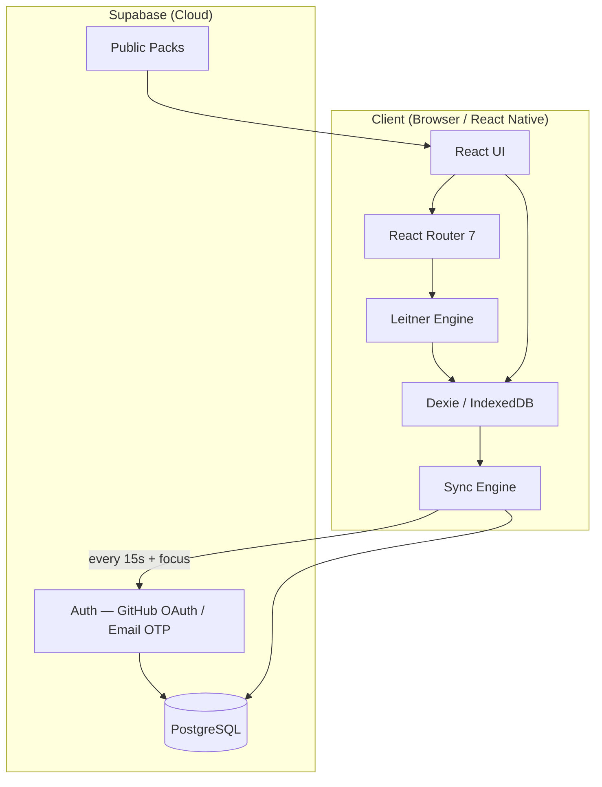
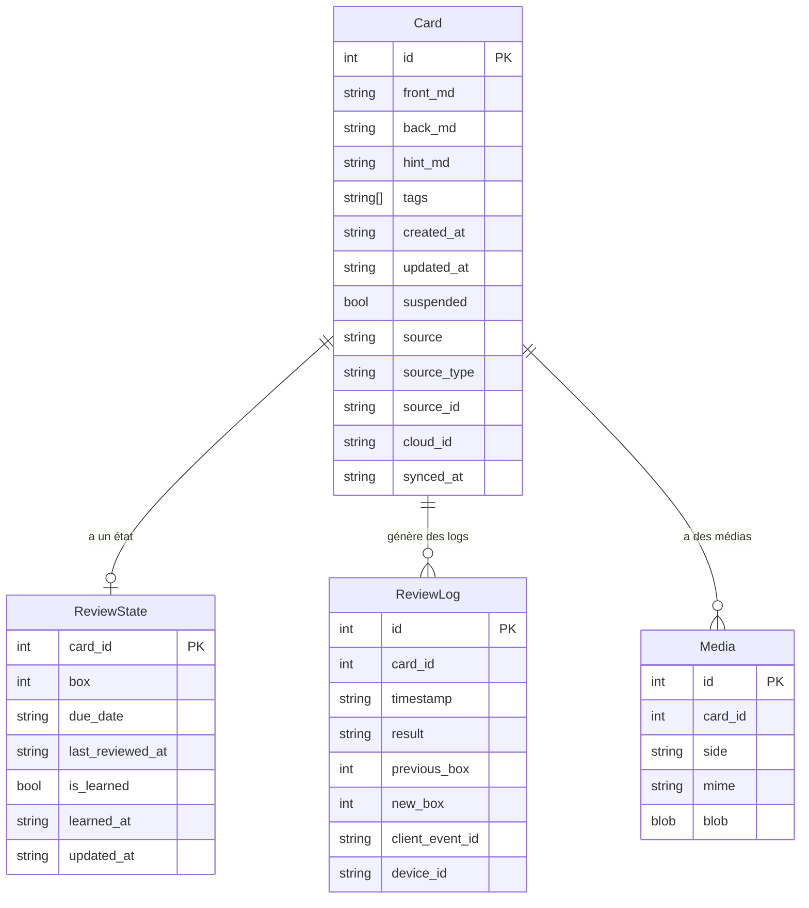
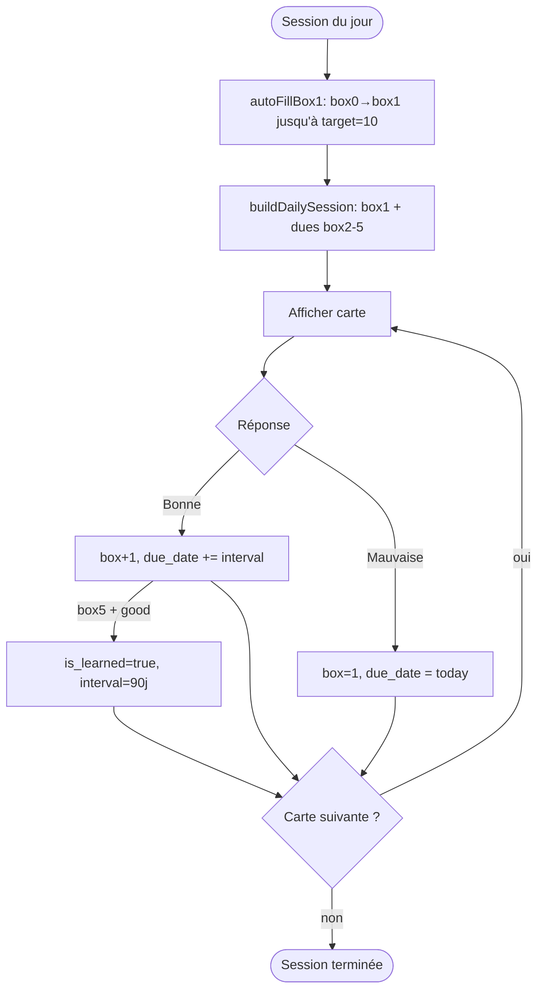

# Architecture — Flashcards
> Généré le 2026-03-26 via /workflows/bmad-brownfield

## Vue d'ensemble



## Flux de données principal

```
1. Utilisateur révise une carte
   └→ ReviewSession appelle applyReviewResult()
       └→ Leitner Engine calcule nouveau box + due_date
           └→ Dexie écrit ReviewState + ReviewLog
               └→ markLocalChange() déclenche sync debounced
                   └→ SyncEngine upsert Supabase (si connecté)

2. Nouvel appareil / reconnexion
   └→ SyncEngine fetch snapshot complet depuis Supabase
       └→ Merge last-write-wins par updated_at
           └→ Dexie mis à jour localement
```

## Modèle de données



## Algorithme Leitner — Flux décisionnel



## Sync Engine — Stratégie

```
Stratégie : Snapshot-based, Last-Write-Wins par updated_at

Pull  → fetchRemoteSnapshot() → merge avec local si remote.updated_at > local.updated_at
Push  → upsertRemoteCards() / upsertRemoteProgress() / upsertRemoteSettings()
Logs  → insertRemoteReviewLogs() (append-only, idempotent via client_event_id)
Deletes → pendingDeletes[] → deleteRemoteCards() au prochain cycle

Déclencheurs :
  - Timer 15s (debounced)
  - window focus
  - markLocalChange() après toute mutation Dexie
```

## Packs publics — Architecture

```
Supabase (tables: packs, public_cards)
    └→ Packs.tsx fetchPublicPacks()
        └→ PackDetail.tsx "Importer"
            └→ Dexie: cards avec source_type='supabase_public'
                └→ Leitner Engine traite ces cartes comme les autres
```

## Pipelines de génération de contenu

```
Natural Earth (shapefile)
    └→ downloadNaturalEarth.ts
        └→ loadCountries.ts (GeoJSON)
            └→ renderCountrySvg.ts (d3-geo, NaturalEarth1 projection)
                └→ generateAllSvgs.ts → out/svg-{transparent,blue}/
                    └→ uploadToSupabase.ts → Supabase Storage
                        └→ seedCountries.ts → table countries
```

## Structure des composants clés

```
AppShell
├── Header (nav)
└── <Outlet> (React Router)
    ├── Home
    │   └── LeitnerInfo, StreakBadge
    ├── ReviewSession
    │   └── MarkdownRenderer (KaTeX + images blob)
    ├── Library
    │   └── TagTreeFilter
    ├── CardEditor
    │   └── MarkdownRenderer (preview)
    ├── Packs → PackDetail
    ├── StatsPage
    └── Settings
        └── AuthButton (Supabase OAuth)
```

## Décisions techniques (ADRs identifiés)

| # | Décision | Raison |
|---|----------|--------|
| 1 | IndexedDB via Dexie (local-first) | Fonctionnement offline, performance, pas de dépendance réseau |
| 2 | Sync snapshot-based (pas event sourcing) | Simplicité, pas besoin d'historique des conflits |
| 3 | Last-write-wins par `updated_at` | Cas d'usage personnel (1 utilisateur, multi-appareils) |
| 4 | KaTeX via remark/rehype | Support LaTeX dans les cartes (maths, sciences) |
| 5 | Pipelines séparés (dist-countries/) | Scripts Node.js isolés du bundle web |
| 6 | React Native/Expo dans apps/mobile/ | Partage possible de la logique Leitner |
| 7 | Tags hiérarchiques (geo/europe/france) | Filtrage TreeView, compatibilité avec les packs publics |
